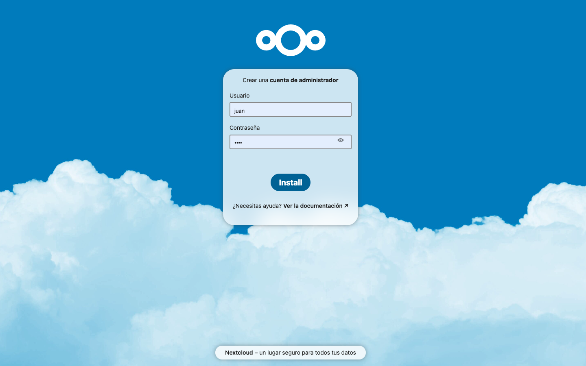
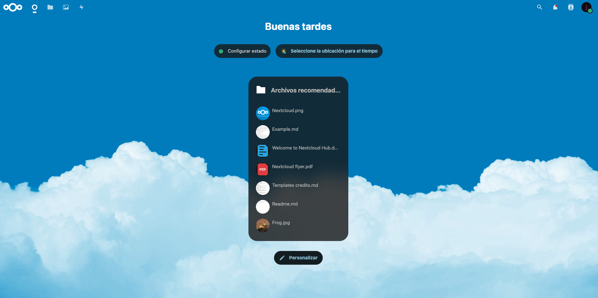
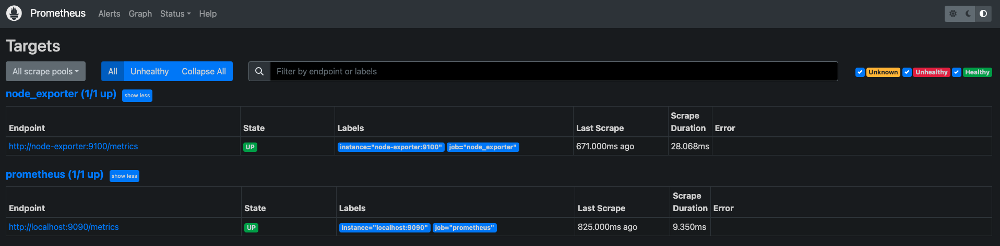
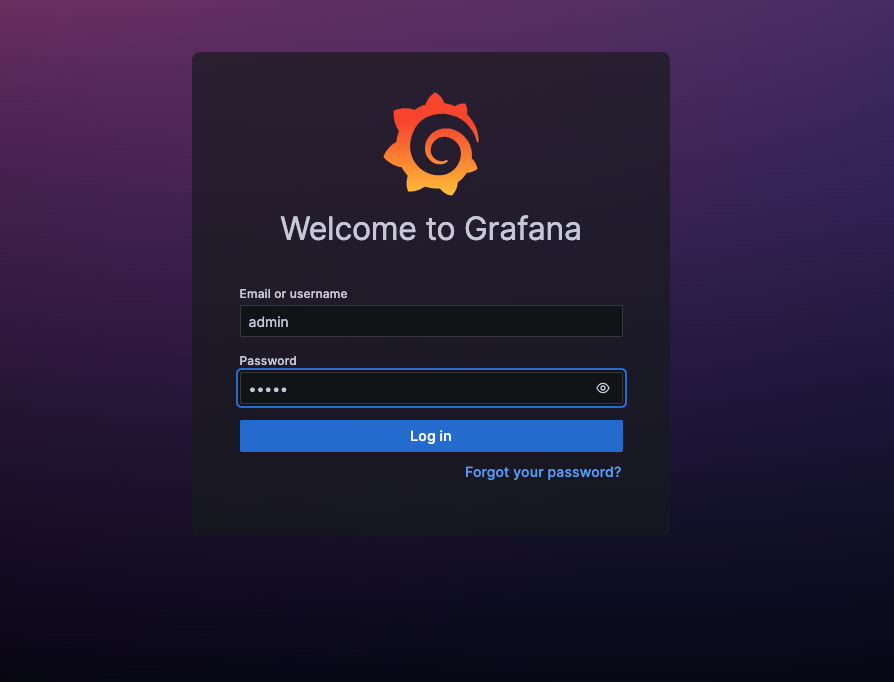
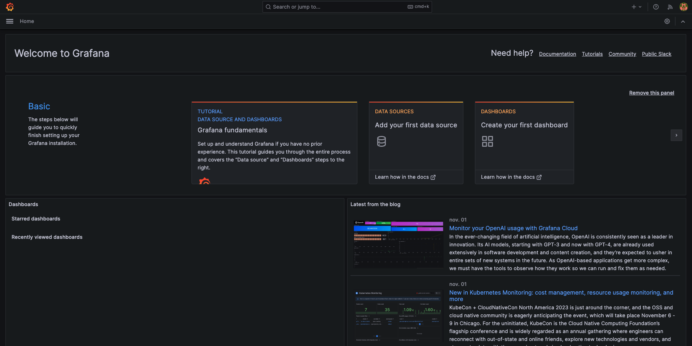
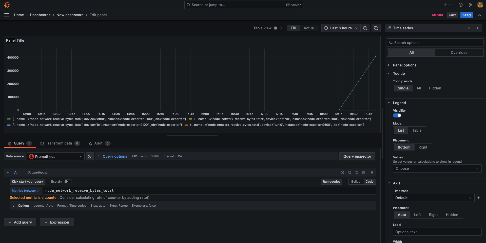

Proyecto del curso Computación en la nube con virtualización liviana (Kubernetes)

Autor: Juan Navarro

Docentes: Edgar Magana, Eduardo Grampin

---

# Introducción
Este proyecto consiste en el despliegue mediante Kubernetes de un sistema de almacenamiento en la nube (Nextcloud) junto con su base de datos (MySQL). Además se le agrega un sistema de monitoreo de datos del nodo utilizando Grafana, Prometheus y Node-Exporter.

El despliegue se puede realizar de dos formas, utilizando Kustomization o utilizando Helm. La opción con Helm permite editar facilmente algunos parametros de la configuración por lo que se recomienda utilizarla.

# Sistemas utilizados

- Nextcloud[1] como sistema de almacenamiento en la nube.
- MySQL[2] como base de datos.
- Grafana[3] como visualizador de datos de gestión.
- Prometheus[4] como recolector de datos.
- Node Exporter[5] como agente de Prometheus.

## Nextcloud

El despliegue de Nextcloud consta de un deployment, un service, un persitent volume y un persistent volume claim. En el deployment como configuración a destacar, se utilizó un configmap para pasarle al contenedor los datos de conexión a la base de datos y se agrego un livenessProbe. El service se configura como LoadBalancer para poder acceder al puerto 80 del contenedor mediante un puerto configurable en localhost.

## MySQL

Al igual que Nextcloud, consiste en un deployment, un service, un persitent volume y un persistent volume claim. La configuración es la estándar. También se utilizó un configmap con el nombre de la base de datos que debe crear y la contraseña de root.

## Grafana

Para Grafana se utilizó un deployment y un service. En el deployment se configuró un livenessProbe y mediante el configmap se le pasa el usuario y contraseña por defecto. En el service se crea el LoadBalancer que permite acceder al sitio desde el exterior (localhost) en un puerto configurable.

## Prometheus

Prometheus se despliega utilizando un deployment donde se agrega un livenessProbe y se le pasan dos argumentos (archivo de configuración y ruta de la base de datos) al container, y un service del tipo LoadBalancer para acceder al sistema desde el exterior (localhost) en un puerto configurable. Mediante el configmap se edita el archivo de configuración para indicarle a Prometheus que debe incluir al Node Exporter como fuente de datos.

## Node Exporter

El agente node exporter se despliega como un DaemonSet ya que como su función es recopilar datos del nodo, es útil que se asegure su ejecución en todos los nodos. Se le configuran limites de consumo tanto de CPU como de memoria. Además expone su servicio mediante un service del tipo Cluster IP.

# Parámetros

| Parámetro                   | Descripción                                                | Valor por defecto         |
|-----------------------------|------------------------------------------------------------|---------------------------|
| nexcloud.mysql_host         | Contenedor donde se encuentra la base de datos             | mysql-service             |
| nextcloud.mysql_user        | Usuario de la basde datos                                  | nextcloud                 |
| nextcloud.mysql_password    | Contraseña de la base de datos                             | nextcloud                 |
| nextcloud.pv_size           | Tamaño del PV                                              | 5Gi                       |
| nextcloud.pv_path           | Path del PV                                                |                           |
| nextcloud.pvc_size          | Tamaño del PVC                                             | 5Gi                       |
| nextcloud.image             | Imagen utilizada                                           | nextcloud:stable          |
| nextcloud.replicas          | Cantidad de replicas del pod                               | 1                         |
| nextcloud.externalport      | Puerto del host al cual se redirige el puerto del servicio | 80                        |
| mysql.mysql_root_password   | Contraseña del usuario root                                | nextcloud                 |
| mysql.mysql_database        | Base de datos a crear                                      | nextcloud                 |
| mysql.image                 | Image utilizada                                            | mysql:8.2.0               |
| mysql.pv_size               | Tamaño del PV                                              | 1Gi                       |
| mysql.pv_path               | Path del PV                                                |                           |
| mysql.pvc_size              | Tamaño del PVC                                             | 1Gi                       |
| prometheus.image            | Imagen utilizada                                           | prom/prometheus:v2.47.2   |
| prometheus.externalport     | Puerto del host al cual se redirige el puerto del servicio | 8081                      |
| grafana.default_user        | Usuario por defecto                                        | admin                     |
| grafana.default_password    | Contraseña por defecto                                     | admin                     |
| grafana.image               | Imagen utilizada                                           | grafana/grafana:10.2.0    |
| grafana.externalport        | Puerto del host al cual se redirige el puerto del servicio | 8080                      |
| node_exporter.image         | Imagen utilizada                                           | prom/node-exporter:v1.6.1 |
| node_exporter.cpulimit      | Límite de utilización de CPU                               | 2                         |
| node_exporter.request       | Cantidad de CPU solicitado                                 | 1                         |
| node_exporter.memorylimit   | Límite de utilización de memoria                           | 1000Mi                    |
| node_exporter.memoryrequest | Cantidad de memoria solicitada                             | 500Mi                     |

# Despliegue y configuraciónes básicas

Se explicará el despliegue utilizando Helm Charts. 

1) Ejecutar el chart

```
helm install miproyecto helmchart
```

Se debe obtener la siguiente salida:

```
NAME: miproyecto
LAST DEPLOYED: Thu Nov  2 18:15:00 2023
NAMESPACE: default
STATUS: deployed
REVISION: 1
TEST SUITE: None
NOTES:
Proyecto para el curso de computación en la nube con virtualización liviana (Kubernetes)
Author: Juan Navarro - juan.navarro@fing.edu.uy
Professor: Edgar Magana, Eduardo Grampin

Images deployed
-Nextcloud: nextcloud:stable
-MySQL: mysql:8.2.0
-Prometheus: prom/prometheus:v2.47.2
-Grafana: grafana/grafana:10.2.0
-Node Exporter: prom/node-exporter:v1.6.1

External access
-Nextcloud: http://localhost:80
-Prometheus: http://localhost:8081
-Grafana: http://localhost:8080

To get the Prometheus endpoint for configuration in Grafana, run the following command:

kubectl get endpoints | grep prometheus-service | awk '{print $2}'
```

2) Verificar que esté todo corriendo correctamente

```
% helm list
NAME      	NAMESPACE	REVISION	UPDATED                             	STATUS  	CHART                  	APP VERSION
miproyecto	default  	1       	2023-11-02 18:15:00.700159 -0300 -03	deployed	kubernetesProject-1.0.0
```

```
% kubectl get pods
NAME                                    READY   STATUS    RESTARTS   AGE
grafana-deployment-749956f69f-hft9j     1/1     Running   0          6m57s
mysql-deployment-6d6d99c5b9-q7sjk       1/1     Running   0          6m57s
nextcloud-deployment-7b74f746df-gnfz6   1/1     Running   0          6m57s
node-exporter-vm278                     1/1     Running   0          6m57s
prometheus-deployment-b9dc47d7b-plgmv   1/1     Running   0          6m57s
```

```
% kubectl get deployments
NAME                    READY   UP-TO-DATE   AVAILABLE   AGE
grafana-deployment      1/1     1            1           7m9s
mysql-deployment        1/1     1            1           7m9s
nextcloud-deployment    1/1     1            1           7m9s
prometheus-deployment   1/1     1            1           7m9s
```

```
% kubectl get services
NAME                 TYPE           CLUSTER-IP       EXTERNAL-IP   PORT(S)          AGE
grafana-service      LoadBalancer   10.104.127.224   localhost     8080:31362/TCP   7m15s
kubernetes           ClusterIP      10.96.0.1        <none>        443/TCP          5d1h
mysql-service        ClusterIP      10.96.87.172     <none>        3306/TCP         7m15s
nextcloud-service    LoadBalancer   10.106.175.53    localhost     80:31175/TCP     7m15s
node-exporter        ClusterIP      10.98.52.185     <none>        9100/TCP         7m15s
prometheus-service   LoadBalancer   10.107.47.252    localhost     8081:32533/TCP   7m15s
```

```
% kubectl get daemonsets
NAME            DESIRED   CURRENT   READY   UP-TO-DATE   AVAILABLE   NODE SELECTOR   AGE
node-exporter   1         1         1       1            1           <none>          7m25s
```

```
% kubectl get endpoints
NAME                 ENDPOINTS           AGE
grafana-service      10.1.0.250:3000     7m31s
kubernetes           192.168.65.3:6443   5d1h
mysql-service        10.1.0.246:3306     7m31s
nextcloud-service    10.1.0.249:80       7m31s
node-exporter        10.1.0.247:9100     7m31s
prometheus-service   10.1.0.248:9090     7m31s
```

```
 % kubectl get pv
NAME                                       CAPACITY   ACCESS MODES   RECLAIM POLICY   STATUS      CLAIM                        STORAGECLASS   REASON   AGE
mysql-pv                                   1Gi        RWO            Retain           Available                                                        10m
nextcloud-data-pv                          5Gi        RWO            Retain           Available                                                        10m
pvc-13f71c10-9c7d-4d93-aa5e-e034346929c3   1Gi        RWO            Delete           Bound       default/mysql-pvc            hostpath                10m
pvc-72145978-8ec2-42cf-813d-c89b92f719dd   5Gi        RWO            Delete           Bound       default/nextcloud-data-pvc   hostpath                10m
```

```
% kubectl get pvc
NAME                 STATUS   VOLUME                                     CAPACITY   ACCESS MODES   STORAGECLASS   AGE
mysql-pvc            Bound    pvc-13f71c10-9c7d-4d93-aa5e-e034346929c3   1Gi        RWO            hostpath       10m
nextcloud-data-pvc   Bound    pvc-72145978-8ec2-42cf-813d-c89b92f719dd   5Gi        RWO            hostpath       10m
```

3) Nextcloud

En el navegador ingresar a http://localhost:80, se solicitará crear el usuario administrador, ingresar un nombre de usuario, contraseña y hacer click en install.



Luego de unos minutos se completará la instalación y se redirigirá a la página principal del usuario administrador.



***Observación:*** El despliegue esta configurado para reconocer automaticamente el servidor y los datos de la base de datos. En caso de que no suceda se debe ingresar la IP del servidor MySQL, se puede obtener con el siguiente comando:

```
kubectl get services | grep mysql-service | awk '{print $3}'
```

4) Prometheus

En el navegador ingresar a http://localhost:8081, ir a Status->Targets y verificar que el Node-Exporter fue reconocido.



5) Grafana

En el navegador ingresar a http://localhost:8080, se solicitará el usuario y contraseña por defecto.





Una vez que se haya ingresado, lo primero es agregar el data source, en este caso prometheus. Ir a Home->Connections->Data sources, allí se elige Prometheus y se debe colocar la IP y puerto del endpoint de Prometheus, estos datos se pueden obtener de la siguiente forma:

```
kubectl get endpoints | grep prometheus-service | awk '{print $2}'
```

Para agregar un dashboard ir a Home->Dashboards->Create dashboard->Add visualization, se selecciona la fuente de datos y luego se agregan las queries deseadas, todas las que comienzan con node son las aportadas por el Node-Exporter.



6) Finalmente para matar todo el chart se debe ejecutar el siguiente comando

```
helm delete miproyecto
```

# Conclusiones

Con la realización de este trabajo se buscó aplicar los conocimientos del curso de la manera mas amplia posible. Para ello se crearon varios servicios utilizando muchos de los resourses vistos (deployment, service, daemonset, configmap, pv, pvc, etc). También se estudiaron los parámetros mas relevantes de cada resourse y se aplicaron.

Se comenzó trabajando directamente en Kubernetes, creando los yaml y "ejecutandolos" de a uno, luego se paso a utilizar Kustomization para ser mas eficiente y finalmente Helm Charts, que es una herramienta que no se vio en el curso pero se recomendó usar. Luego de estudiar su funcionamiento y aplicarlo en este trabajo quedan claras las ventajas de su utilización. Otro aspecto a destacar es que se estuvo constantemente utilizando los comandos de Kubertenes (kubectl get ..., kubectl describe ..., etc) para verificar el correcto despliegue de los servicios.

Como reflexión final sobre Kubernetes entiendo que es una plataforma sumamente útil, escalable y versátil que simplifica la gestión de contenedores. Su popularidad en el mundo de la administración de contenedores lo convierte en una herramienta esencial que permite a las organizaciones aprovechar al máximo los beneficios de la contenerización y la automatización en entornos de nube e infraestructura distribuida. Con Kubernetes, las empresas pueden mejorar la agilidad, la confiabilidad y la eficiencia de sus aplicaciones, lo que lo convierte en una tecnología clave en la era de la infraestructura como código y la nube.


# Referencias

[1]https://nextcloud.com/es/

[2]https://www.mysql.com/

[3]https://grafana.com/

[4]https://prometheus.io/

[5]https://github.com/prometheus/node_exporter
